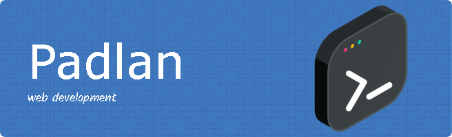

# Hallo semuanya!

#### Tentang saya

- saya seorang pelajar dari **SMK Budi Bakti Ciwidey**
- Saya sedang belajar **PHP** dan **Javascript**

#### Bahasa yang dipakai

#### Framework yang dipakai

#### Sosial media

 
